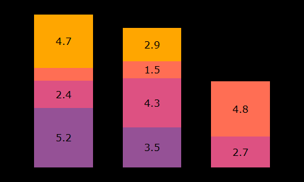

# Stretch project 1<br/>Bar chart function using jQuery and CSS grids

- [About](#about)
- [Context](#context)
- [Usage](#usage)
- [API](#api)
- [Features](#features)
- [Options](#options)
- [Known issues](#known-issues)
- [Future features](#future-features)
- [Resources](#resources)

See the function in use on [Github Pages](https://ycandau.github.io/sp1_bar_chart/).

---

## About

This is the first stretch project from the prep module for the [Lighthouse Labs](https://www.lighthouselabs.ca/) web development bootcamp.

---

## Context

The project provides a function to create a bar chart using only HTML and CSS. More specifically, it relies on jQuery to access and manipulate the DOM, and nested CSS grids for the layout.

---

## Usage

Embed the required JS script files:

```html
<script src="https://ajax.googleapis.com/ajax/libs/jquery/3.5.1/jquery.min.js"></script>
<script src="js/bar_chart.js"></script>
```

Create an empty div element that will contain the bar chart:

```html
<div id="element"></div>
```

Create a one dimensional or two dimensional array of values:

```javascript
const data1D = [5.2, 1.3, 10.9, 4.1]

const data2D = [
  [5.2, 2.4, 1.1, 4.7],
  [3.5, 4.3, 1.5, 2.9],
  [0, 2.7, 4.8],
]
```

Create an object holding the options for the bar chart (see [below](#options) for more):

```javascript
const options = {
  'chart.width': '500px',
  'chart.height': '300px',
  'chart.title': ...
}
```

Call the bar chart function in a jQuery `.ready()` method to execute once the DOM is fully loaded:

```javascript
$(() => {
  drawBarChart(data2D, options, $('#element'))
})
```

---

## API

The API includes one function only:

```javascript
function drawBarChart(data, options, element)
```

Arguments:

- data: Array\<number> | Array\< Array\<number\>\>
- options: Object<string, number | string>
- element: A jQuery object or DOM element

Returns:

- The DOM element containing the chart

---

## Features

The bar chart displays simple bars for single values, or stacked bars for multiple values. Switching between the two is automatically set based on the structure of the `data` variable (1D or 2D array of numbers):

- 1D arrays of numbers

```javascript
const data1D = [5.2, 1.3, 10.9, 4.1]
```


- 2D arrays of numbers

```javascript
const data2D = [
  [5.2, 2.4, 1.1, 4.7],
  [3.5, 4.3, 1.5, 2.9],
  [0, 2.7, 4.8],
]
```


Options can be set using compact dotted keys:

```javascript
const options = {
  'chart.width': '500px',
  'chart.height': '300px',
  'chart.color': '#f8ea8c',
  'chart.background-color': 'black',
  'chart.font-family': 'Verdana',
  'title.text': 'Fruit production per province',
  'yAxisTitle.text': 'Production (millions kg)',
  'yAxisLabels.precision': 0,
  'legend.text': ['Apples', 'Pears', 'Prunes', 'Berries'],
  'xAxisLabels.text': ['ON', 'QC', 'BC', 'AB'],
  'bars.gaps': ['0.25fr', '0.5fr', '0.25fr'],
  'bars.colors': ['#955196', '#dd5182', '#ff6e54', '#ffa600'],
  'values.position': 'center',
  'values.precision': 1,
  'values.color': 'black',
  'legend.color': 'black',
  'gridlines.interval': 5,
}
```

Or nested objects:

```javascript
const options = {
  chart: {
    width: '500px',
    height: '300px',
    color: '#f8ea8c',
    ...
  }
  ...
}
```

The various components of the chart can be toggled to display or not. The bars adjust their width automatically depending on the amount of available horizontal space. The values inside the bars are only displayed if the corresponding height is sufficient. See for instance how the third value in the second bar below is skipped.

```javascript
const options = {
  ...
  'title.draw': false,
  'yAxisTitle.draw': false,
  'yAxisLabels.draw': false,
  'xAxisLabels.draw': false,
  'legend.draw': false,
  'gridlines.draw': false,
  ...
}
```



---

### Options

| Component     | Option             | Values                         | Default                       |
| ------------- | ------------------ | ------------------------------ | ----------------------------- |
| `chart`       | `width`            | CSS dimension                  | 500px                         |
|               | `height`           | CSS dimension                  | 300px                         |
|               | `font ...`         | CSS font property              | Arial                         |
|               | `color`            | CSS color                      | #ff8                          |
|               | `background-color` | CSS color                      | black                         |
| `title`       | `text`             | string                         |                               |
|               | `draw`             | true \| false                  | true                          |
|               | `font ...`         | CSS font property              |                               |
|               | `color`            | CSS color                      |                               |
| `yAxisTitle`  | `text`             | string                         |                               |
|               | `draw`             | true \| false                  | true                          |
|               | `font ...`         | CSS font property              |                               |
|               | `color`            | CSS color                      |                               |
| `yAxisLabels` | `draw`             | true \| false                  | true                          |
|               | `precision`        | number                         | 0                             |
|               | `font ...`         | CSS font property              |                               |
|               | `color`            | CSS color                      |                               |
| `gridlines`   | `draw`             | true \| false                  | true                          |
|               | `interval`         | number                         | 5                             |
|               | `color`            | CSS color                      |                               |
| `bars`        | `colors`           | Array [ CSS colors ... ]       |                               |
|               | `gaps`             | Array [ left, between, right ] | ['0.25fr', '0.5fr', '0.25fr'] |
| `values`      | `draw`             | true \| false                  | true                          |
|               | `position`         | top \| center \| bottom        | center                        |
|               | `precision`        | number                         | 1                             |
|               | `font ...`         | CSS font property              |                               |
|               | `color`            | CSS color                      |                               |
| `legend`      | `text`             | Array [ strings ... ]          |                               |
|               | `draw`             | true \| false                  | true                          |
|               | `font ...`         | CSS font property              |                               |
|               | `color`            | CSS color                      |                               |
| `xAxisLabels` | `text`             | Array [ strings ... ]          |                               |
|               | `draw`             | true \| false                  | true                          |
|               | `font ...`         | CSS font property              |                               |
|               | `color`            | CSS color                      |                               |

<br/>
Further notes on specific options:

| Option      | Notes                                                                                                                                                                                                                     |
| ----------- | ------------------------------------------------------------------------------------------------------------------------------------------------------------------------------------------------------------------------- |
| `text`      | To set text content, either a string, or an array of strings.                                                                                                                                                             |
| `draw`      | To display the component or not.                                                                                                                                                                                          |
| `font`      | Includes `font`, `font-style`, `font-weight`, `font-size`, `font-family`.                                                                                                                                                 |
| `precision` | The decimal precision with which to display numbers.                                                                                                                                                                      |
| `interval`  | The interval between two gridlines.                                                                                                                                                                                       |
| `gaps`      | An array of three strings to define the horizontal space left, in between, and to the right of the bars. These can be fixed CSS dimensions, or proportional dimensions such as `0.5fr`, relative to a bar width of `1fr`. |

---

## Known issues

The optional gridlines for the bar chart are created with a `repeating-linear-gradient()` CSS property to simplify the layout. The value passed to this property is rounded to have gridlines of consistent thickness. This creates a slight vertical offset as the rounding errors accumulate.

---

## Future features

- Making it possible to reorganize the layout, for instance by changing the location of the legend, or switching the side on which the Y-Axis title is displayed.
- Creating a responsive layout that adjusts to the size of the viewport.

---

## Resources

- [jQuery documentation](https://jquery.com/)
- [CSS Grid Layout reference](https://developer.mozilla.org/en-US/docs/Web/CSS/CSS_Grid_Layout)
- [Grid guide from CSS-Tricks](https://css-tricks.com/snippets/css/complete-guide-grid/)
- [More grid tutorials from Joomlashack](https://www.joomlashack.com/blog/joomla-news/basics-of-css-grid/)
